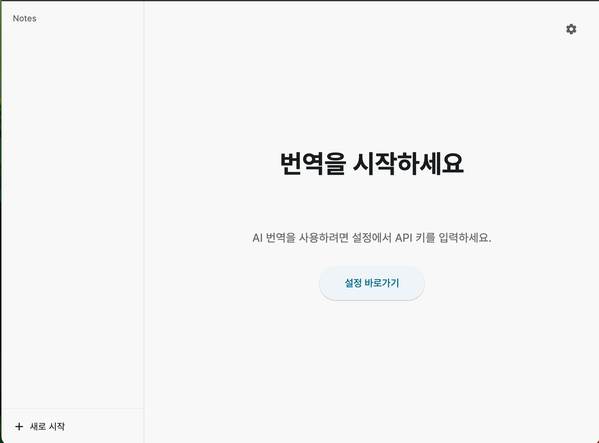
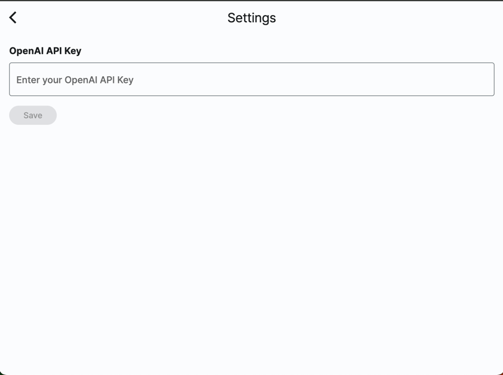
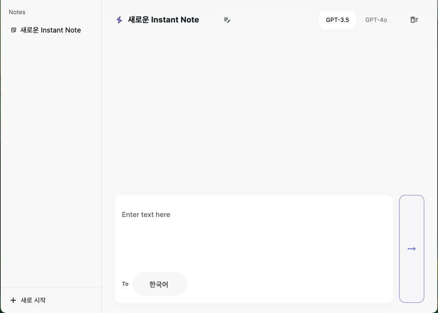
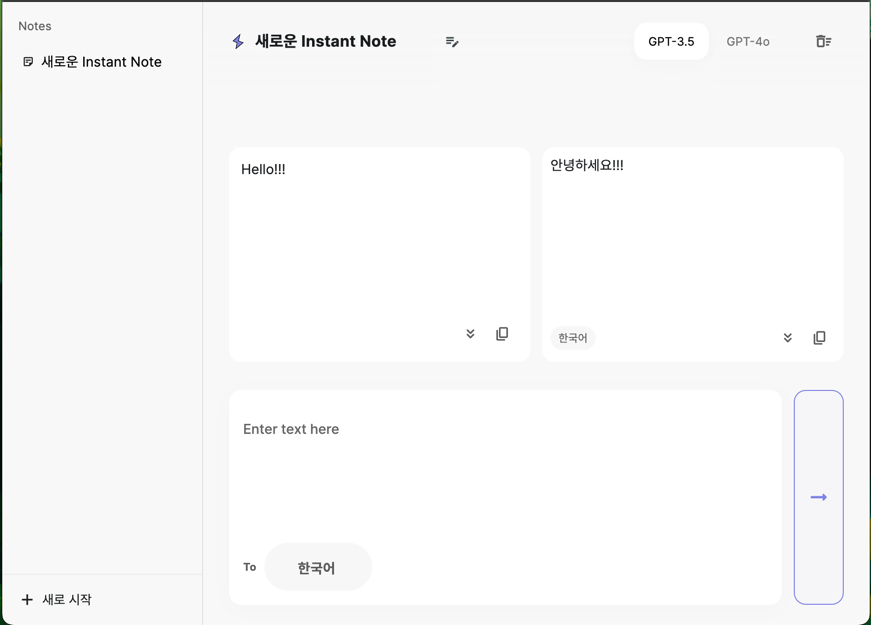

# GPT-Translator Desktop App

** UNIST HeXA 최마진 프로젝트 **
** 1일 해커톤 **

# What is GPT-Translator Desktop App?

지피티를 통해 번역을 할 수 있는 데스크탑 앱입니다.

지피티를 통해 번역을 하다 보면, 매번 '번역 해줘' 를 입력해야 하는 번거로움이 있습니다.
그리고, 글이 길어지면 지피티로는 번역하기가 매우 힘들죠.

이를 해결하기 위해, 지피티를 사용하는, 완벽한 번역 앱을 만들고자 합니다.

지금은 InstantNote만 개발되었으나, 긴 텍스트를 번역할 수 있는 DocumentNote 가 TODO로 남아있습니다.

# 구현 전략

Figma를 통해 기획, 디자인 후 Flutter로 제작하였습니다.
번역한 내용은 sqlite를 통해 로컬에 저장됩니다.

# 자랑거리?

디자인이 예뻐요

# 스샷

